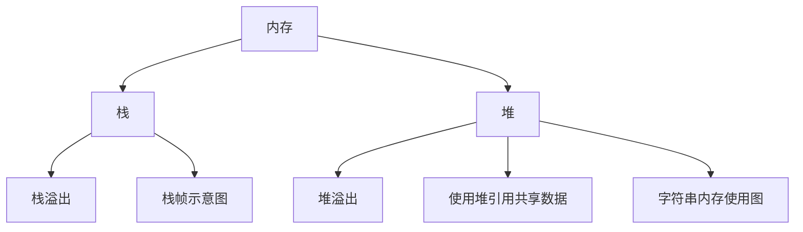

# 内存

~~~admonish note title="graph made by cursor" collapsible=true

~~~

~~~admonish abstract title="Summarize made by cursor" collapsible=true
本文主要介绍了 Rust 中的内存管理:
- 包括栈和堆的概念、栈溢出和堆溢出的问题以及如何使用堆引用共享数据。
- 文章通过图片和代码示例详细讲解了这些概念和问题
- 对于 Rust 初学者来说是一篇很好的入门文章。
~~~

~~~admonish question title="Questions made by cursor" collapsible=true
1. Rust中的内存管理包括哪些概念和问题？
2. 什么是栈和堆？它们有什么区别？
3. 如何使用堆引用共享数据？
4. 如何考虑栈溢出和堆溢出的问题？
~~~

~~~admonish tip title="Answers made by cursor" collapsible=true
1. Rust中的内存管理包括哪些概念和问题？
本文介绍了 Rust 中的内存管理，包括栈和堆的概念、栈溢出和堆溢出的问题以及如何使用堆引用共享数据。

2. 什么是栈和堆？它们有什么区别？
栈和堆都是内存中的一部分，栈是一种后进先出的数据结构，用于存储函数调用时的局部变量和函数调用的返回地址等信息，而堆是一种动态分配内存的机制，用于存储程序运行时动态分配的数据。栈和堆的主要区别在于它们的分配方式和管理方式不同。

3. 如何使用堆引用共享数据？
可以使用指针或引用来引用堆中的数据，从而实现数据的共享。在 Rust 中，可以使用 Box<T> 类型来创建堆上的数据，并使用 & 操作符来创建指向堆上数据的引用。

4. 如何考虑栈溢出和堆溢出的问题？
栈溢出和堆溢出都是内存管理中的常见问题。栈溢出通常是由于递归调用或者函数调用层数过多导致的，可以通过增加栈的大小或者优化代码来解决。堆溢出通常是由于动态分配内存时没有正确释放导致的，可以通过手动释放内存或者使用 Rust 的内存管理机制来解决。
~~~

<!--ts-->

* [内存](#内存)
    * [字符串内存使用图](#字符串内存使用图)
    * [栈](#栈)
        * [栈帧示意图](#栈帧示意图)
        * [考虑栈溢出](#考虑栈溢出)
    * [堆](#堆)
        * [使用堆引用共享数据](#使用堆引用共享数据)
        * [考虑堆溢出](#考虑堆溢出)

<!-- Created by https://github.com/ekalinin/github-markdown-toc -->
<!-- Added by: runner, at: Wed Mar 29 06:23:03 UTC 2023 -->

<!--te-->

## 字符串内存使用图

~~~admonish info title='字符串内存使用图' collapsible=true

~~~

## 栈

### 栈帧示意图

~~~admonish info title='栈帧示意图' collapsible=true

~~~

### 考虑栈溢出

## 堆

### 使用堆引用共享数据

~~~admonish info title='使用堆引用共享内存数据' collapsible=true

~~~

### 考虑堆溢出

~~~admonish info title='堆问题示意图' collapsible=true

~~~
